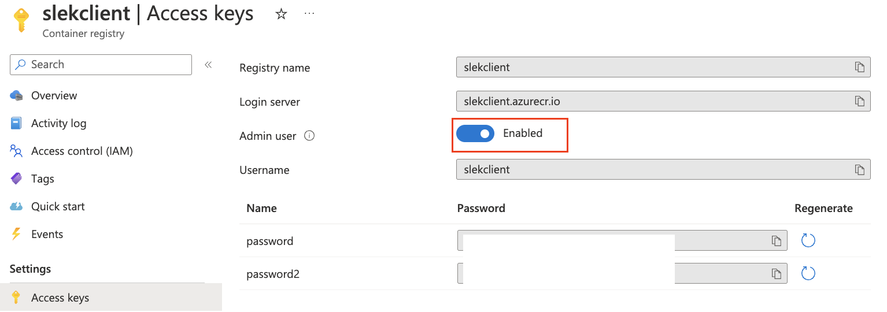

# DevOps 3. časť

#### Ciele cvičenia
- Oboznámiť sa s nasadzovaním kontajnerizovanej aplikácie na platforme AWS - pokračovanie
  - AWS RDS (manažovaná relačná DB Postgres) - databáza
  - AWS CloudFront (CDN) - klient
  - AWS S3 (object storage) - klient
  - AWS ECS (Docker containers) - server
  - Prepojenie služieb a architektúra (3. prednáška k DevOps časti - diagramy, teória).
- Vyskúšať si nasadenie na niektorú cloud computing platformu (MS Azure, AWS a pod.)

#### Prerekvizity
- Zostavené a funkčné Docker images server + PWA klient, pripravené na nasadenie
  - Konfigurovateľné premenné prostredia (ENV)
  - Zabezpečená perzistencia dát (RDBMS)

#### Návod na získanie kreditov pre Digital Ocean, MS Azure (GitHub Student Developer Pack)
1. Zaregistrujte si [GitHub Student Developer Pack](https://education.github.com/pack), využite univerzitnú @stuba mailovú adresu.
2. Dokončite registráciu a prihláste sa do služby.

#### Úloha č. 1: Oboznámte sa s nasadzovaním na platforme AWS ECS (Elastic Container Service) - pokračovanie
V spolupráci s cvičiacim sa oboznámte s nasadzovaním kontajnerizovanej webovej aplikácie (klient, server, RDBMS databáza) na platforme AWS ECS.
  - AWS RDS (manažovaná relačná DB Postgresql) - východisko pre vysokú dostupnosť, replikáciu, zálohovanie...
  - AWS CloudFront (CDN) - optimalizácia doručovania obsahu klientom (statické assety - obrázky, CSS a pod.) + vstupná brána pre klientov (ochrana pred DDoS).
  - AWS S3 (object storage) - úložisko pre statické assety (HTML, CSS, JS, media)
  - Prepojenie služieb, architektúra a konfigurácia - siete a bezpečnostné skupiny (VPC), cache policy (CDN), static website hosting (S3 + CloudFront), DB snapshots (RDS), service update (ECS) a i. 

#### Úloha č. 2: Nasaďte vašu aplikáciu na zvolenú cloudovú platformu (návod pre Azure)
Vyberte si niektorú cloud platformu (AWS, MS Azure, Digital Ocean a pod.) a vykonajte nasadenie vašej aplikácie (postačuje nasadenie Docker kontajnerov na niektorú orchestračnú platformu - AWS ECS, Azure Container Apps a pod.).
Návod pre MS Azure:
1. Prihláste sa do svojho účtu a choďte na [Azure Home](https://portal.azure.com).
2. Vytvorte si repozitár pre Docker obrazy - [Container Registries](https://portal.azure.com/#blade/HubsExtension/BrowseResource/resourceType/Microsoft.ContainerRegistry%2Fregistries).
	- Vytvorte nový repozitár
    - Po rozkliknutí repozitára choďte do sekcie Access Keys - povoľte Admin user, bude vám vygenerované používateľské meno a heslo.
    - Prihláste sa do vytvoreného repozitára príkazom 
```docker login <vase_repo>.azurecr.io```
	- Tagnite váš Docker image a odošlite ho do Azure repozitára

	```docker tag pwa-client <vase_repo>.azurecr.io/slek-client```

	```docker push <vase_repo>.azurecr.io/slek-client```
    

    
3. Vytvorte kontajner pre BE časť vašej aplikácie - [Azure Container Apps](https://portal.azure.com/#view/HubsExtension/BrowseResource/resourceType/Microsoft.App%2FcontainerApps)
- Basics - vyberte reosurce group, nastavte meno kontajnera, vyberte región pre nasadenie.
- App Settings - odškrtnite "use quick start image", vyberte cestu k vášmu slek-server v **Azure Container Registries** repozitári, zvoľte požadovanú **konfiguráciu inštancie** (postačuje 0,25 CPU, 0,5 GB RAM). Nastavte tiež **premenné prostredia** - pozor na cestu k databáze (DB_HOST, resp. PG_HOST). Pre začiatok môžete nastaviť "localhost", po následnom spustení databázy na Azure (napr. ako ďalší kontajner) **nezabudnite túto premennú prostredia aktualizovať**. Povoľte tiež **Ingress - Accepting traffic from anywhere**, vystavíte tak službu, aby bola dostupná odkiaľkoľvek. Nezabudnite **špecifikovať port** (napr. 3333).


4. Vytvorte konrajner pre databázu, použite pritom službu [Azure Container Instances](https://portal.azure.com/#view/HubsExtension/BrowseResource/resourceType/Microsoft.ContainerInstance%2FcontainerGroups). Nastavte inštanciu podľa obrázkov nižšie. Po rozkliknutí vytvorenej inštancie nájdete endpoint v sekcii Overview - IP address (public).


5. Vytvorte kontajner pre klienta (slek-client). Nezabudnite, že slek-client musí byž zostavený s premennou API_URL **smerujúcou na váš novonasadený backend** - krok 3 (pre vyššiu bezpečnosť môžete použiť HTTPS endpointy). Pomôcka: vonkajšiu adresu slek-server kontajnera nájdete po jeho rozkliknutí v sekcii **Ingress**. Pozor, po presadení kontajnera slek-server vám Azure môže vygenerovať novú ingress adresu.


6. Aktualizujte premennú prostredia DB_HOST (resp. PG_HOST) pre váš slek-server kontajner jeho rozkliknutím a zvolením -> Container -> Environment variables -> Edit and deploy. Použite IP adresu Postgres inštancie z kroku 4. V sekcii Scale zvoľte interval pre repliky 1-1.


6. Rozkliknite nasadený kontajner slek-server, zvoľte sekciu Console - Bash terminál a zmigrujte databázu:

```
node ace migration:refresh --seed
```
7. Rozkliknite nasadený kontajner slek-client, skopírujte ingress adresu a preverte funkcionalitu vašej PWA aplikácie.
